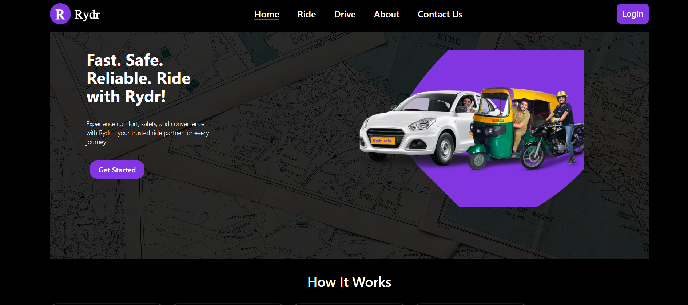
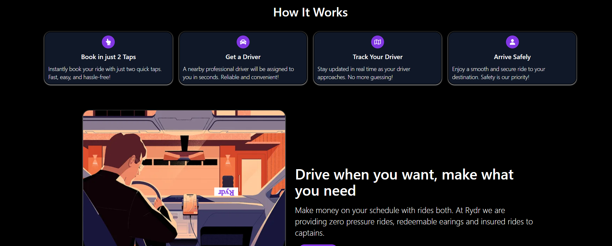
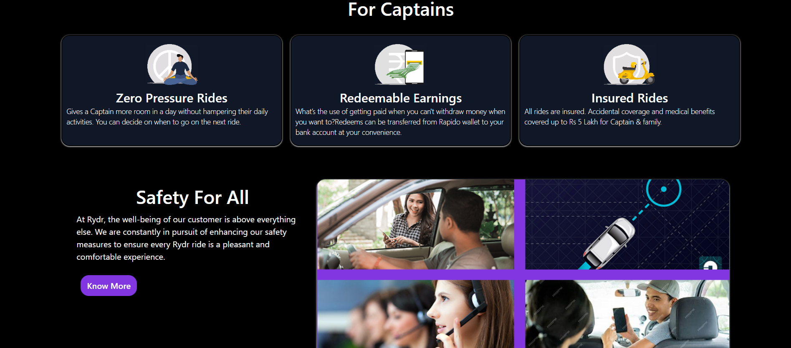
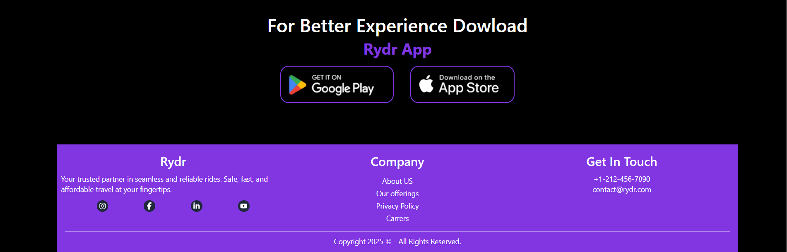
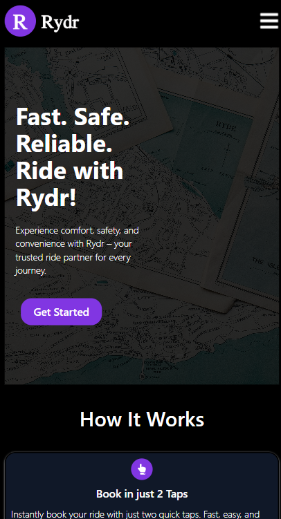
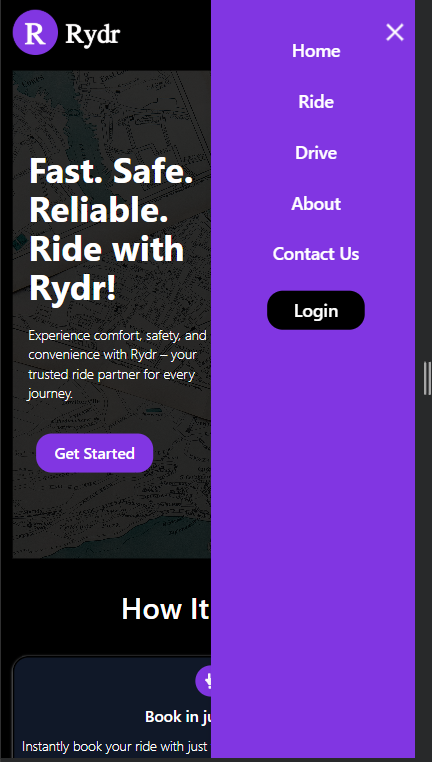
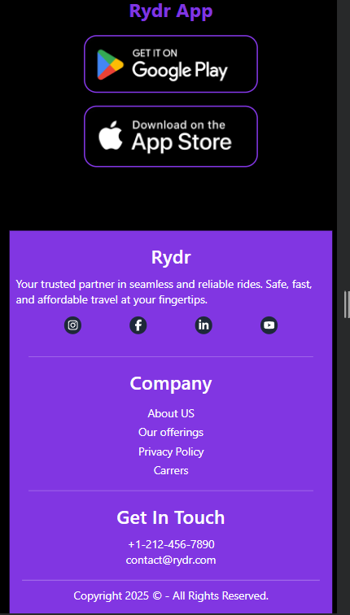

# 🚖 Rydr - Ride Sharing Platform

Rydr is a modern ride-sharing platform built using the **MERN Stack**. It provides seamless real-time communication between captains and users, location tracking, authentication.

## 🚀 Features

- **User & Captain Authentication** using `jsonwebtoken`, `bcrypt`, and `express-session` (OAuth functionality).
- **Real-time Chat** between users and captains using `socket.io`.
- **Live Tracking** using `Google Maps API`.
- **OTP & Verification** powered by `crypto` for secure transactions.
- **Email Notifications** via `nodemailer`.
- **Secure Password Handling** with `bcrypt`.
- **Robust Validation** using `express-validator`.
- **Seamless API Requests** with `axios`.
- **Responsive UI** built with `React.js`, `Tailwind CSS`, `HTML`, `CSS`, and `Lottie Animations` for an engaging experience.
- **Cross-Origin Resource Sharing (CORS)** enabled for secure data sharing.

## 🛠️ Tech Stack

| Technology      | Usage |
|---------------|--------|
| **Frontend**   | React.js, HTML, CSS, Tailwind CSS, JavaScript, Lottie Animations, React-Toast |
| **Backend**    | Node.js, Express.js, MongoDB |
| **Real-time**  | Socket.io |
| **Authentication** | JSON Web Token (JWT), Express-session (OAuth), Crypto, Bcrypt, Cookie-Parser |
| **Location Services** | Google Maps API |
| **Validation & Security** | Express-validator, CORS |
| **Email Services** | Nodemailer |
| **API Calls** | Axios |

## 📸 Screenshots

### 🚀 Home Page

<div style="display: flex; justify-content: space-between; align-items: flex-start; width: 95%; margin: auto;">
  
  <!-- Left Column: Vertical Images -->
  <div style="display: flex; flex-direction: column; gap: 10px; width: 50%; align-items: center;">
    
    
    
    
  </div>

  <!-- Right Column: Horizontal Images -->
  <div style="display: flex; flex-wrap: wrap; gap: 10px; width: 50%; justify-content: center;">
    
    
    
  </div>

</div>

## ⚙️ Installation

### Prerequisites
Make sure you have **Node.js**, **MongoDB**, and **npm/yarn** installed.

### Clone the repository
```bash
git clone https://github.com/devrajsinh-d-jethwa/Rydr.git
cd Rydr
